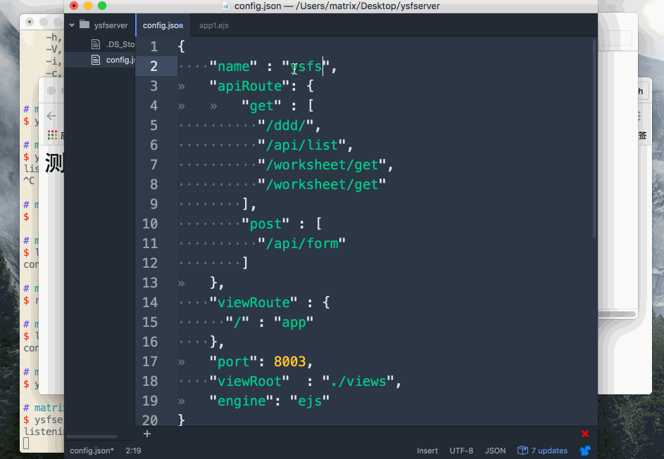

# ysfserver
七鱼数据服务代理平台


## 命令安装
> sudo npm install ysfserver -g

## 命令启动
> ysfserver -h

```javascript
  Usage:  ysfserver [options...]

  Options:
    -i,--init     初始化ysfserver目录
    -c,--config   配置文件
    -h,--help     帮助列表
```

## config.json文件

```json
    {
        "name" : "测试服务器",
   	    "apiRoute": {
   		    "get" : [
                "/ddd/",
                "/api/list",
                "/worksheet/get",
                "/worksheet/get"
            ],
            "post" : [
                "/api/form"
            ]
        },
        "viewRoute" : {
            "/" : "app1"
        },
        "port": 8002,
        "viewRoot"  : "./views",
        "engine": "ejs"
   }

```

## Egg调研

## 程序使用Demo


